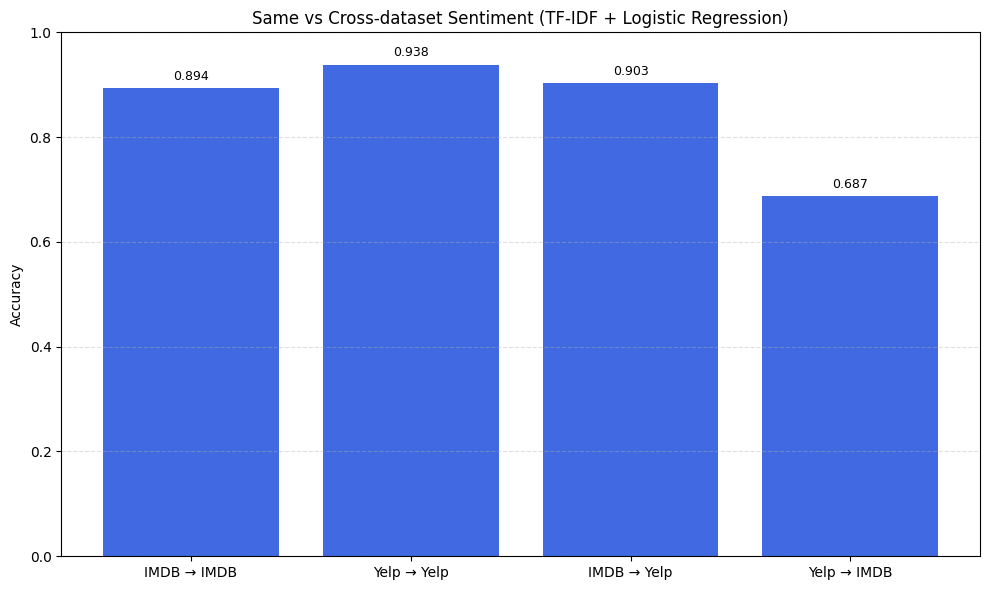
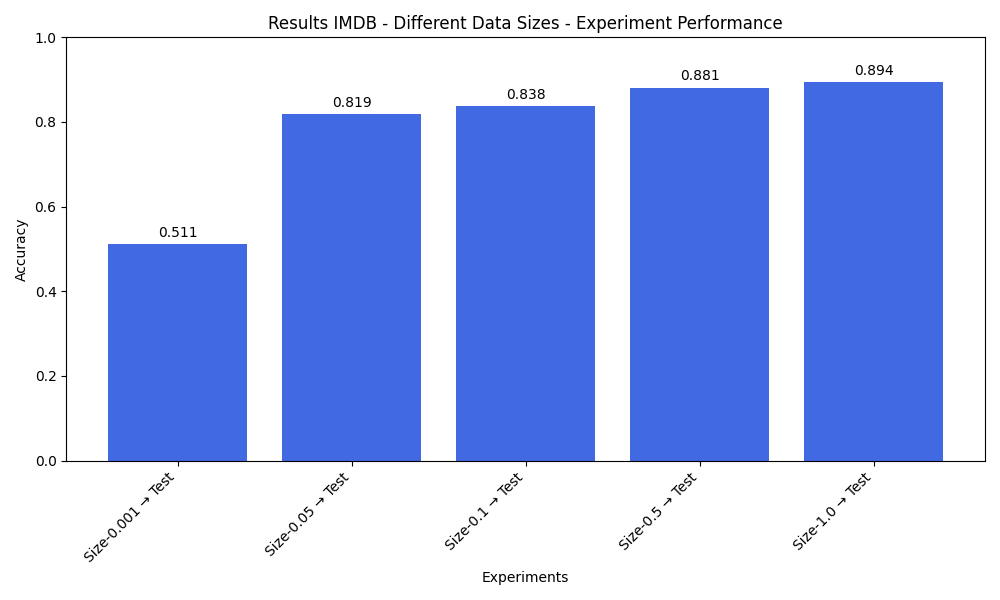
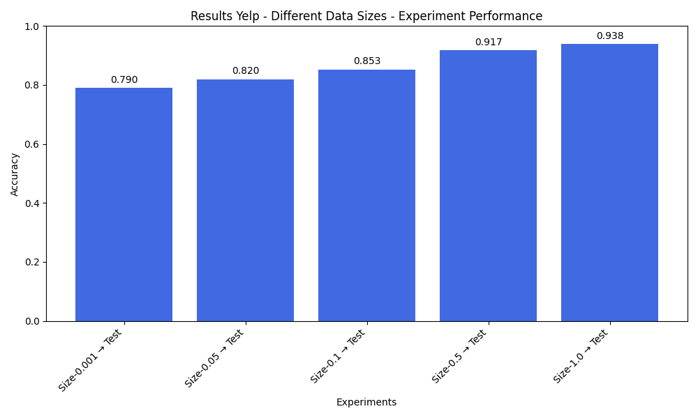

# NLP Cross-dataset Classification

This repository contains an experiment on sentiment classification using two text datasets: **IMDB** and **Yelp**. The primary goal is to train machine learning models (using TF-IDF and Logistic Regression) to predict sentiment in movie reviews (IMDB) and business reviews (Yelp).

  

## Algorithm Overview

The algorithm uses a **Logistic Regression** classifier, which is trained on features extracted from text data using **TF-IDF** (Term Frequency-Inverse Document Frequency). The process works as follows:

- **TF-IDF Vectorization**: The text data is transformed into numerical features using TF-IDF, which computes the importance of each word relative to the entire dataset. This allows the model to focus on the most relevant words for sentiment classification.
  
- **Logistic Regression**: This linear classifier adjusts its weights based on the TF-IDF features to predict sentiment labels (positive or negative). The training process involves minimizing classification errors by adjusting these weights.

- **Model Evaluation**: Accuracy is used as the evaluation metric. After training, the model's performance is tested on a separate dataset to see how well it generalizes to new data.

## Project Structure

The project is organized as follows:

- **main.py**: Contains core functions for data reading, preprocessing, training, and performance evaluation. It utilizes **TF-IDF** for text transformation and **Logistic Regression** for classification.
  
- **desafios.py**: Contains scripts to execute different experiments based on various data configurations. This includes challenges on **data sizes**, **combining IMDB and Yelp data**, and **data drift** analysis.

- **data/**: Folder containing raw data files:
  - `imdb_train.parquet`, `imdb_test.parquet`: IMDB data.
  - `yelp_train.json`, `yelp_test.json`: Yelp data.

- **results/**: Folder where performance results, including accuracy metrics and plot images, are saved.

## How to Run the Project

### Prerequisites

1. Python 3.x
2. Install the dependencies:
    ```bash
    pip install -r requirements.txt
    ```

### Data Structure

- **IMDB**: Contains movie reviews with columns `text` and `label`, where `label` indicates if the review is positive or negative.

- **Yelp**: Contains business reviews with columns `text` and `stars`, where `stars` is a rating from 1 to 5. In this project, 3-star ratings are treated as neutral, 4 or 5 stars as positive, and 1 or 2 stars as negative.

### Execution

Run the experiments by executing **desafios.py**:

```bash
python desafios.py
```

## Challenges

The project includes the following key challenges:

### 1. Test with Different Data Sizes
   - **Objective**: Evaluate how well the model performs when trained with varying fractions of the data (e.g., 1%, 5%, 10%, 50%, 100%).
   - **Function**: `run_with_different_sizes()` trains and tests the model with different data sizes to assess performance scaling.

### 2. Test with Combined IMDB + Yelp Data
   - **Objective**: Train the model on both IMDB and Yelp data combined and evaluate it on the IMDB test dataset.
   - **Function**: `run_with_all_data()` combines the datasets for training and tests the model on the IMDB test set.

## Results

Each experiment’s results are displayed in the console and saved as performance plots.

### 1. Results for Different Data Sizes (IMDB)
   - **Objective**: Measure the model's accuracy when trained on different fractions of the IMDB dataset.
   

### 2. Results for Different Data Sizes (Yelp)
   - **Objective**: Similar to the IMDB experiment, this evaluates the model on different sizes of the Yelp dataset.
   

### 3. Results Using Combined IMDB + Yelp Data
   - **Objective**: Evaluate the model’s performance when trained on both datasets combined and tested on the IMDB test dataset.
   

## Features

- **Data Preprocessing**: The text is cleaned, and reviews with neutral ratings (3-star reviews in Yelp) are excluded. The texts are then transformed into numerical representations using **TF-IDF**.
  
- **Model Training**: **Logistic Regression** is used as the classifier, trained on the TF-IDF features extracted from the review texts.

- **Evaluation**: The model is evaluated using accuracy, and the results are visualized in bar charts for easy comparison across different experimental setups.

- **Visualization**: The results are displayed in bar charts and saved in the `results/` directory, making it easy to track the performance of the model under different conditions.

## Conclusion

This project demonstrates the application of sentiment analysis on two distinct text datasets, IMDB and Yelp, using machine learning. By experimenting with various data configurations, including different training sizes and handling data drift, we gain insight into the model’s robustness and generalization capabilities when encountering data from different domains.